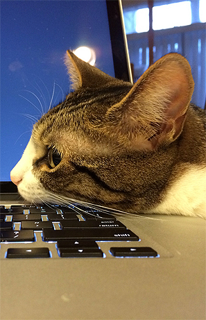

#设置

  在开始用C编程志强，我们需要先安装些东西，并建立好我们需要的编程环境。由于C是很通用的语言所以这个过程会很简单。我们主要需要装来个东西。一个文本编辑器，一个编译器。


  

#文本编辑器

  文本编辑器是一个用来编写程序文本的程序。

  在Linux上我推荐使用gedit。不论你用的是哪个版本得linux它都是可以运行的。如果你用的是Vim或者Emacs也是可以的。请不要使用IDE。它对这样的小项目是完全不需要的，亦不会帮助你明白究竟发生了什么事情。

  在Mac上有一个叫TextWrangler的简单文本编辑器。千万不要使用Xcode。

  在Windows上推荐使用Notepad++。当然其它的也可以，千万不要使用Visual Studio。它不适合写C语言，如果你用它的话会带来很多麻烦。

#编译器

  编译器是一个将C语言源代码转换为电脑运行的二进制代码。这部分的安装取决于你用的是什么操作系统。

  编译和运行C代码需要命令行的简单使用。这部分我不会讲到，因此我假设命令行的使用你是熟悉的。如果你不会的话，请到网上搜索你操作系统对应的相关教程。

  在linux上你可以下载一些包来安装编译器。如果你在使用Ubuntu或者Debian可以通过下面命令安装

  >sudo apt-get install build-essential

  如果你用的额是Fedora或者相似的linux那么使用下面的命令

  >su -c "yum groupinsall develepment-tools"

  在Mac上你可以在Apple Store 上下载Xcode。如果你不确定怎么做你可以上网搜索"installing Xcode" 。之后你需要安装 Command Line Tools 。在Mac OSX 10.9上可以在命令行运行 
  >xcode-select --install 

  在10.9之前的版本上可以在Xcode的选项，下载,然后选择Comand Line Tools 来安装。

  在Windows上你可以下载安装安装MinGW。如果你的安装器提示你一列可选的包，记得一定要选`mingw32-base`和`msys-base`。安装完成后你要把编译器添加到你的`PATH`环境变量中。如果PATH不存在的话就创建一个，把`;C:MinGW\bin`添加到该值下。你需需要重新打开`cmd.exe`检查修改是否起效了。之后你就可以在`cmd.exe`命令行下运行编译器了。

#测试编译器

  测试你的编译器是否安装完成，请在你的命令行下运行

  >cc --version

  如果有关于编译器的相关信息返回的话那么就表示正确安装了。如果你得到的一些错误信息或者说命令无法找到，那么就是没有安装成功。你得重新来过。

#Hello World

  现在你的环境配置好了，在你可文本编辑器里输入下面的程序。最好创建一个文件夹在存放本书代码，并把该文件命名为`hello_world.c`。下面是你的C代码

  ```c
  #include<stdio.h>
  int main(int argc, char** argv){
    puts("Hello , World");
    return 0;
  }
  ```
  这些代码可能并没有什么实际意义。让我来一点点解释它。

  在第一行我们导入的叫头，这个声明允许我们使用在`stdio.h`的函数，它里面包含了C中得标准输入输出库。里面有个`puts`函数我们会在后面用到。

  接下来我们声明了一个函数名称是`main`的函数。这个函数定义用来输出一个`int`，并且接受一个`int`型的`argc`，一个`char**`型的`argv`。所有的C程序都会包含这个函数。所有的程序都是从这个函数开始执行的。

  在`main`，的`puts`函数参数是`"Hello, World"`。它的输出是在命令行输出一个`Hello,World`消息。函数`puts`是`put string`的简写。在函数中得第二个声明是`return 0;`。这句告诉`main`函数结束运行并返回`0`。当C程序返回一个`0`表示程序运行的没错误。

#编译

  在我们运行该程序前，我们需要先编译。这将会产生真正的可执行程序。打开命令行并浏览你保存`hello_world.c`的文件夹。你可以通过以下命令编译你的程序。
  >cc -std=c99 -Wall hello_world.c -o hello_world

  这将会编译`hello_world.c`的代码,报告所有的警告，并输出一个可执行文件`hello_world`。使用`-std=c99`参数指明C的版本标准。这会让编译器确定我们的代码是标准的，这样人们可以在不同的操作系统或者编译器上使用我们的代码。

  如果编译成功，你会再当前文件夹下看到输出文件。命令`./hello_world`（在windows上用`hello_world`）会运行这个程序。

  恭喜！你已经完成你的第一个C程序了。

#错误

  如果你的代码有什么问题的话，编译过程就会失败。原因可能是简单地语法错误，也可能其它更难理解的问题。
  
  有时候编译器输出的错误是很有帮助的，但如果你看不懂得话就尝试这上网搜索。这样你就可以通过网上的帮助修改你的错误了。记住：很多人在你之前就犯过这些错误了。

  有时候很多错误的原因都来自一个地方，一定要从第一个错误开始修改。

  

  有时候编译器生成的程序你一运行就崩溃了。这时候调试C代码就比较难了，这就是本书之外的艺术了。

  如果你是一个初学者，那么在你崩溃的程序中多加入些输出点，这样你就可以分离出来错误究竟是哪个部分产生的了。只要你不仅仅是盯着代码看，那么调试过程就会舒服些，并且缓解让你想放弃的情绪。

  使用`gdb`是一种更好地调试程序的方法。虽然这个工具很难操作，但这是一个可以给你提供更多可用信息的一个好方法。关于怎么使用`gdb`的方法可以去网上查找。

  在Mac上尤其是最近的OS X中并没有`gdb`。你可以是使用`lldb`，它可以完成绝大部分相同的工作。

  在Linux或者Mac`valgrind`可以用来调试内存溢出和其它头疼的错误。Valgrind可以为你省去数小时甚至数天得调试工作。使用它并不需要太精通它，所以强烈推荐你们使用，相关用法可以在网上查找。

#文档
 
  通过这本书你可能会在代码例子中有些不认识的函数。你可能想知道它究竟是什么，你可以查阅[在线文档](http://en.cppreference.com/w/c)，它包含了所有标准库中得函数以及使用方法。

#参考

  这节是讲什么的？

  我会把我这节对用的代码链接在下面。当你完成这节是你的代码应该和下面的代码类似。

  如果你遇到了bug，千万不要直接复制我的代码。尝试着定位错误点，并把我的代码只用作参考。

  ```c
  #include<stdio.h>
  int main(int argc,char** argv) {
    puts("Hello , World!");
    return 0;
  }
  ```


