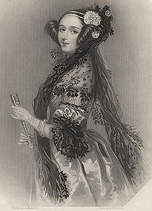

#关于

在这本书中你将会学习C语言，同时学习如何通过仅有的1000多行代码建立你自己的编程语言，一个最基本的lisp！我们会用一个库来做一些初始化的工作，所以在代码行数上有些虚报，但剩下的代码就是完全原始，并且最后你真的会创建一个强大的小lisp。

  这本书灵感启发来自另在 scrach 上的一个一步步建立自己的的编程语言的教程。我写这本书是为了展示这种有趣并带有创造性的方式学习语言是很好的方式，而且不仅仅局限于抽象的高级语言，或者经验丰富的程序员。

  很多人很想学 C ，但不知从何学起。如果你按照这本书中写的做，我保证至少你可以得到一个很酷的新编程语言，而且你很有可能成为一个经验丰富的C程序员。

#这本书是为谁准备的

  这本书是为所有想学C，或者那些曾经想学怎样创建自己的编程语言的人准备的。这不适合作为第一本编程书籍，而是为那些有一定基础的，想要学些新的或者有趣的东西的人准备的。

  我尽可能的让这本书对初学者更友好。我很欢迎初学者主要是应为他们有很多有待发现的东西！但初学者可能会发现这本书比较有挑战性。我们会覆盖诸多新内容，以及尽可能同时学习两门语言。

  如果你向别人寻求帮助别人可能会不耐烦。你会发现他们会花时间表达他们对某些方面是有多了解。经验丰富的程序员或许会告诉你你错了。他们的言下之意就是你应该停止 Coding ，而不是继续写这么糟糕的代码。
  
  

  多次发生这样的事情后，你可能会觉得你不适合做一个程序员，或者你就是做不好。你也可能想你曾经想过创建你自己的编程语言，但现在你意识到它是多么的抽象而且你不想再关心了。你现在考虑的是你其他的热情，以及任何可以让你感觉愉悦，有趣，或者欢乐的事情就会成为你学习的障碍。

  对此我只能抱歉。程序员可能是孤僻的，高傲的，缺乏安全感的，或者好斗的。没有什么原因可以解释这些现象。没有人一开始就是这样的。每个人都挣扎或纠结自己的能力。千万不要放弃或者让其他事情占据你创造的经历。对你现在做的事情感到骄傲，不管你做的是什么。像我这样的人不希望你放弃编程。我们想听到你的声音，大胆的说吧。

#为什么学习C
  C语言是世界上最受欢迎和最有影响力的语言之一。它是 linux 操作系统的开发语言，并被广泛应用于 OSX 的开发而且 windows 在一定程度上也是 C 开发的。它也被用在微型计算机的开发上。你的冰箱或者汽车上可能就跑着呢。在现代软件开发中，C 的使用可能会比较落后。任何一个想要做软件开发的人都应该学习C。

  但 C 不适合用在软件开发和职业生涯。C 是一个关于自由的议题。它因是诸如 Unix,Linux,以及 Libre 等软件活动的开发语言而声名鹊起。它是个人自由在计算机界的化身。它给你控制影响你生活技术的控制权。

  在技术比以往更重要的时代，它的存在将越来越重要。

  自由的含义是 C 自身的天然属性。C 几乎没有有东西藏在你后面，包括它的缺点和瑕疵。它甚至不会阻止你做任何事情，包括让你的程序以一种可怕的方式结束。当用 C 编程时你不是站在一条路上而是许多选择，C 鼓励你去做决定。

  C也是一门充满乐趣的语言。在主流媒体解释它之前，我们是这样解释Hacking的。它的哲学是美化那些有趣和聪明的东西。而不是非法访问未授权的电脑。Hacking 的哲学是探索，个人表达，打擦边球，和打破规则。它代着对抗等级制度和官僚注意。庆祝独立。Hacking 给你欢乐，知识，荣誉。Hacking 是电脑联通网络的保证，是你拥有改变世界的工具。

  想要掌握 C 就需要关注强大，聪明，和自由。成为一个通过手指点击就能掌控强大技术，并且能做让世界受益的事情的程序员。
