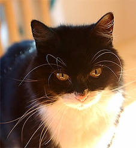

#什么是编程语言？

  编程语言和现实中的语言哼相似。它们背后都有一个结构，而且有些规则可以用来判断听写是不是有效。当我们读写自然语言时，我们在无意识中学会了这些规则，同样这些也可以用在编程语言上。我们可以抱着写规则集合到一起来明白别人的语言，完成演讲或者代码。

  在20世纪50年代，语言学家[诺姆·乔姆斯基](http://en.wikipedia.org/wiki/Chomsky_hierarchy)列出了大量关于语言的观察，很多成为了我们今天语言的基础。其中一个就是自然语言是建立在结构的递归和重复之上的。

  举个例子:

  > The cat walked on the carpet.
  
  > The cat and dog walked on the carpet.
  
  

  英语的规则里`cat`可以被两个用`and`隔开的名词替代。

  每个新的名词可以再次被替换。我们也可以其它的名词替换`cat`。或着也可用带有形容词的名词代替，比如:

  >The white cat and black dog walked on the carpet.

  这只是两个简单地例子，但英语中还有很多其它的替代生成方法。

  我们观察到这些在编程语言中也存在。在C语言中`if`语句块的声明包含一系列新的声明，每个声明都可一杯另一个`if`语句代替。这些重复的结构和替代在语言的各个方面都有反映。这些有时候被称为复写规则，因为它们告诉我们怎样把一些语句用其它的语句重写。

  > if (x > 5) { return x; }
  > if (x > 5) { if (x > 10) { return x; } }
  
  乔姆斯基的观察影响十分深远。它意味着尽管有无限的语句可以读写，但我们仍然可以用有些的复写规则来明白它们。这就叫做语法。

  我们可以用很多方法来描述复写规则。其中一种就是原文。我们可以说“一个句子必须有动词短语”，或者“一个动词短语可以可以是一个动词或者一个副词加动词”。这样的表述对于人来说是很好明白的，但对计算机来说就太不精确了。当在编程时我们需要写下更正式的语法描述。

  想要写一个像Lisp的语言我们首先得明白它的语法。为了读取用户的输入我们的写一个语法来描述它。然后我们就可以在用户输入是决定输入是否有效。我们也可以用它建立一个结构化的内在表示，用来完成理解输入的工作，然后再求值，内部进行编码计算。

  这就是`mpc`库的由来。

#解析组合器

  `mpc`是我写的一个解析组合器。这意味着有一个库可以然你用来构建理解处理特定语言的程序。这个被称为解析器。建立解析器可以有很多不同的方法，但一个很酷的事情是用解析组合器可以让你构建解析器更简单，只需要指定语法就好了。

  很多解析组合器都是让你写一些有点像语法的代码，而不是直接指定语法。很多情形下这是没问题的，但有时可能变的笨重和复杂。幸运的是`mpc`库允许我们写一些像语法的普通代码，或者我们可以使用特定的符号直接写语法！

#编码语法

  那么像语法的代码是什么样子的呢？我们通过写一个识别(柴犬语)[the language of Shiba lnu](http://knowyourmeme.com/memes/doge)语法的代码吧。口语中多叫Doge。我们定义的语言将会像下面这样：

  >形容词只包括"wow","many","so","such"
  >名词只有"licp","language","book","build"
  >短语是形容词后节名词
  >Doge是0或者短语

  我们可以试着先定义名词和形容词。我们用mpc_parser_t*类型定义两个短语，分别存在`Adjective`和`Noun`中。用`mpc_or`函数创建短语，并用`mpc_sym`函数包装我们的初始化字符串。

  如果你眯着眼睛，你可以尝试读取代码，就好像它是我们在上面指定的规则。

  ```c
  /* Build a parser 'Adjective' to recognize descriptions */
  mpc_parser_t* Adjective = mpc_or(4,
    mpc_sym("wow"),
    mpc_sym("many"),
    mpc_sym("so"),
    mpc_sym("such"),
    ) ;

  /* Build a parser 'Noun' to recognize things */
  mpc_parser_t* Noun = mpc_or(
    mpc_sym("lisp"),
    mpc_sym("language"),
    mpc_sym("build"),
    mpc_sym("book"),
    mpc_sym("c"),
  );
  ```
>我怎样访问`mpc`函数？
>现在不需要担心关于编译这章的任何实例代码。主要关注理解语法背后的东西。在下章我们会设置`mpc`并使用它建立一个和lisp相似的语言

  为了定义短语我们可以参考现存的短语。我们需要用到`mpc_and`函数，用来指定一个元素被另个元素依赖。输入是我们之前定义的`Adjective`,`Noun`。这个函数还需要`mpcf_strfold` `free`参数，用来表达怎样连接或删除这样的短语。暂时先不要管参数。

  ```c
  mpc_parser_t* Phrase = mpc_and(2,mpcf_strfold,
    Adjective,Noun,free);
  ```

  定义doge我破门必须指定0或者短语是必须的。这我们就得用到`mpc_many`函数。像之前一样，这个函数需要指定`mpcf_strfold`变量来知道怎样把它们连接起来，哪些需要忽略

  >mpc_parser_t* doge = mpc_many(mpc_parser_t,Phrase);

创建一个解析器寻找0或多个解析器是很有意思的额。我们的`Doge`解析器接受任何长度的输入。这意味着它的语言是无限的。这里只有一些`Doge`可以接受的可能的短语。就像我们在这节开头讲的那样，我们用有限的复写规则创建一个无限的语言。

  ```
    "wow book such language many lisp"
    "so c such build such language"
    "many build wow c"
    ""
    "wow lisp wow c many language"
    "so c"
  ```

  通过用用`mpc`其它函数，我们可以慢慢构建一个可以解析更多复杂语言的解析器。代码读起来有些像语法，但添加复杂性后就会变得更加凌乱。所以这种方式并不是一个简单的工作。一系列的可以用来构建简单结构来使重复的工作变得简单的函数都再mpc的仓库有文档。这是构建复杂语言的好方法，它允许构建更细粒度的控制，但并不是我们需要的。

#自然语法

  `mpc`允许我们用更自然的方式写语法。而不是像C函数那样看起来不是很像语法的方式，我们可以用过一个长字符串指明一个完整的东西。用这样的方式可以不用关心怎样连接或拆分输入，只需把它交给`mpcf_strfold` `free`，它可以自动帮我们完成这些工作。

  下面是我们用这种方式来重建一下之前的例子。

  ```
  mpc_parser_t* Adjective = mpc_new("adjective");
  mpc_parser_t* Noun = mpc_new("noun");
  mpc_parser_t* Phrase = mpc_new("phrase");
  mpc_parser_t* Doge = mpc_new("doge");
  mpca_lang(MPCA_LANG_DEFAULT,
  "                                           \
    adjective : \"wow\" | \"many\"            \
              |  \"so\" | \"such\";           \
    noun      : \"lisp\" | \"language\"       \
              | \"book\" | \"build\" | \"c\"; \
    phrase    : <adjective> <noun>;           \
    doge      : <phrase>*;                    \
  ",
  Adjective, Noun, Phrase, Doge);

  /* Do some parsing here... */

  mpc_cleanup(4, Adjective, Noun, Phrase, Doge);
  ```

  这种方式不用明白那一长串的字符串的附加含义，这种形式是一种很清楚的语法。要明白所有的符号的含义太麻烦了。

  另一个需要注意的就是现在我们需要两步来完成。首先用`mpc_new`创建和命名一些规则然后通过`mpca_lang`定义它们。

  `mpc_lang`的第一个参数是可选的标志。这里我们用默认的。第二个是一个长的多行的C字符串。这是语法规范。它包含很多重写规则。每个规则都是以`:`左边的名字作为规则名称，右边以`:`结尾的是定义。

  这个用来定义规则的特殊符号的用法如下：


	"ab"	The string ab is required.
	
	'a'	The character a is required.
	
	'a' 'b'	First 'a' is required, then 'b' is required.
	
	'a' | 'b'	Either 'a' is required, or 'b' is required.
	
	'a'*	Zero or more 'a' are required.
	
	'a'+	One or more 'a' are required.
	
	<abba>	The rule called abba is required.

```
听起来很熟悉...

不知道你有没有注意到`mpca_lang`的输入字符串的描述很像我解释过的语法？这是因为`mpc`用它内部的解释器解析了你的输入。而它就是像上面说的那样解析语法的。

```

  上面表格描述的就是我之前写的验证代码的语法。

  这种指明语法的方式就是我们接下来章节要用的方法。起初看起来很吓人。语法一般比较难以理解。但接下来你会慢慢熟悉它并了解如何编写和创建它。

  这节主要讲的是理论，因此如果你打算尝试一些附加题，不要太过担心正确性。想法正确是更重要的。大胆的尝试发明符号和标注吧。一些附加题可能会需要循环或递归语法结构，大胆的尝试吧。

  #参考

  doge_code.c
  ```c
#include "mpc.h"

int main(int argc, char** argv) {

  /* Build a parser 'Adjective' to recognize descriptions */
  mpc_parser_t* Adjective = mpc_or(4, 
    mpc_sym("wow"), mpc_sym("many"),
    mpc_sym("so"),  mpc_sym("such")
  );

  /* Build a parser 'Noun' to recognize things */
  mpc_parser_t* Noun = mpc_or(5,
    mpc_sym("lisp"), mpc_sym("language"),
    mpc_sym("book"), mpc_sym("build"), 
    mpc_sym("c")
  );
  
  mpc_parser_t* Phrase = mpc_and(2, mpcf_strfold, 
    Adjective, Noun, free);
  
  mpc_parser_t* Doge = mpc_many(mpcf_strfold, Phrase);

  /* Do some parsing here... */
  
  mpc_delete(Doge);
  
  return 0;
  
}
  ```

doge_grammar.c

```c
#include "mpc.h"

int main(int argc, char** argv) {

  mpc_parser_t* Adjective = mpc_new("adjective");
  mpc_parser_t* Noun      = mpc_new("noun");
  mpc_parser_t* Phrase    = mpc_new("phrase");
  mpc_parser_t* Doge      = mpc_new("doge");

  mpca_lang(MPCA_LANG_DEFAULT,
    "                                           \
      adjective : \"wow\" | \"many\"            \
                |  \"so\" | \"such\";           \
      noun      : \"lisp\" | \"language\"       \
                | \"book\" | \"build\" | \"c\"; \
      phrase    : <adjective> <noun>;           \
      doge      : <phrase>*;                    \
    ",
    Adjective, Noun, Phrase, Doge);

  /* Do some parsing here... */

  mpc_cleanup(4, Adjective, Noun, Phrase, Doge);
  
  return 0;
  
}
```

#附加题
› Write down some more examples of strings the Doge language contains.
> 多写几个Doge语言的例子。
› Why are there back slashes \ in front of the quote marks " in the grammar?
› Why are there back slashes \ at the end of the line in the grammar?
› Describe textually a grammar for decimal numbers such as 0.01 or 52.221.
› Describe textually a grammar for web URLs such as http://www.buildyourownlisp.com.
› Describe textually a grammar for simple English sentences such as the cat sat on the mat.
› Describe more formally the above grammars. Use |, *, or any symbols of your own invention.
› If you are familiar with JSON, textually describe a grammar for it.
