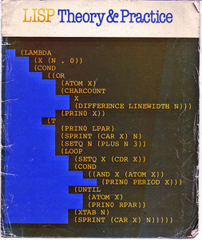

##列表和lisp

  lisp 因它的数据和代码基本没有区别而知名。它们都是由同样的结构表示。这就让 lisp 具有了其它语言所没有的强大威力。如果想把这种特性加入到我们的编程语言中，我们需要把读入和计算分开。

  这章最后的结果和前面的章节有些不同。因为我们将要改变内部处理代码的过程。这叫做做 re-factoring 这会让我们之后的工作更轻松。像准备晚餐一样，我们把食物摆在盘子里不代表我们在浪费时间。有时候期待晚餐比吃晚餐更美好。

  

  我们需要建立一张有数字符号和列表递归构建内部列表来存储我们的代码。在 Lisp 中这个结构体叫做 S 表达式  Symbolic Expression(符号表达式)。我们将会扩展我们的 `lval` 结构体来表示它。评估 S表达式的过程是 lisp 语言的典型过程。评估一个S表达式，我们首先把列表的第一个表项当做操作符。然后遍历剩下的表项，并把它们当做操作数来最后得到结果。

  介绍过S表达式后，我们将正真进入到Lisp的世界。

##指针

  在C语言中列表的概念是通过合适的指针操作实现的。指针是C语言的难点。指针很难学因为它的概念很简单，但有很多新术语，而且经常没有很明确的用例。这让指针的概念变的异常麻烦。幸运的是，我们有很多很好的用例，它们都是C中典型的，而且会囊括指针90%的用法。

  我们需要指针的原因是由于函数调用的工作方式，当你在C中调用函数时参数往往是按值传递的。就是说传给函数的是一个拷贝而已。比如`int` `long` `char` 以及自定义的结构体 `lval` 都是。大多数情形下都没有问题但有时候会带来麻烦。

  最通常的一个问题就是当我们想给函数传递一个很大的机构体时，每次我们调用函数时都要复制一份这个结构体，这样就会耗费大量的空间。

  A second problem is this. When we define a struct, it is always a fixed size. It has a limited number of fields, and each of these fields must be a struct which itself is limited in size. If I want to call a function with just a list of things, where the number of things varies from call to call, clearly I can't use a struct to do this.

 为了解决这些问题，C 语言想出了一个很聪明的办法。它把计算机内存想象成一个巨大的比特列表。这个列表中每个比特位都有一个全局的索引。每个比特就像是个房间号。

  在这种情形下计算机内所有的数据包括结构体和变量，在列表中都有一个开头。相对于把一个数据复制一份传给函数，我们更倾向于传递数据起始的索引，函数就可以读取任何数量的数据了。

  通过使用地址，函数就可以不用复制任何数据来访问和需改内存中的数据了。函数通过指针也可以做到其它的一些事情，比如把数据输出到输入地址的指定地址中。

  因为计算机总内存大小是可变的，地址的比特值表示的地址位置必须是不变的。但如果我们不断记录它的话，地址指针的比特数可能增长或者缩减。这意味着我们可以创建大小可变的数据结构并把它传给函数，在函数中可以对它进行检查和修改。

  因此指针就是一个数字，这个数字代表内存中某个数据的起始地址。指针的类型告诉我们和编译器，这个位置的数据的类型是什么。

  用类型名加`*`声明指针。之前我们已经见过了比如`mpc_parser_t*`,`mpc_ast_t*`,`char*`

  创建某个类型的指针首先得得到它的索引或者地址，用`&`可以取得。

  最后是如何得到某个地址的数据，又叫做引用，使用`*`取得地址的内容。获取指针某个属性使用`->`操作符。

##栈和堆
  
  我讲过内存可以可视化成一个很长的比特列表。事实上把它想成两个分开的部分更好。这两个部分分别是堆和栈。

  大家可能听说过他俩的一些特征比如，栈是向下生长的堆是向上生长的，或者栈可以有很多但堆只有一个。这些大部分步是很正确。在C中处理它们是很复杂的，但也不是很神秘。本质上它们就是两个内存的部分，并用于不同的任务。

##栈

  栈是你代码生存的地方。你操纵编辑的所有临时变量和数据结构都是存在这里。你每次调用函数，栈就会分配新的内存空间，这部分内存存储的是局部变量，传给函数的参数，以及一些书签数据比如谁调用的它，以及函数结束时应该干些什么。当函数返回时这部分内存将会被回收，等待再次被分配。

  我喜欢把栈想成一个建筑工地。每次我们想做新的事务时就分配一部分新的空间，这部分空间将足够我们堆放我们的工具和材料，并开始工作。一旦这部分工作做完了，我们就把这部分空间清理干净，并留给后面需要时候用。

##堆

  堆是用来存储生命周期很长的对象的内存部分。这不分的内存需要手动的分配和回收。用 `malloc` 函数分配堆上的内存。这个函数的参数是需要内存的大小，并返回一个指向新内存块的指针。

  当这部分内存不在使用是需要释放掉。通过将之前返回的指针传递给 free 函数来做这件事。

  堆的使用比栈更麻烦，因为需要程序员手动调用 free 函数释放，如果没有正确释放掉就会导致更多的内存被分配。这叫做内存泄露。一个基本的原则就是确保每个 `malloc` 函数都对应一个 `free` 函数。只要确保这一点就可以让程序正确处理堆的内存分配。

  我把堆想象成一个巨大的 U-store。 可以通过调用 `malloc` 函数制作一定大小的盒子。用这些盒子我们可以做我们想做的事情，我们知道不论建筑多么的乱它始终会存在。我们可以从 U-store 中取出东西来建造建筑。用它来存储材料和大型的一次性的对象是很方便的。唯一的问题就是我们一定得记得用 free 函数来回收它。否则可用的空间就会越来越少直达耗尽。

##解析表达式

  既然开始考虑使用 s 表达式而不是波兰符号，我们得升级我们的解析器。S 表达式的语法很简单。它就是括号内的一些表达式而已，这些表达式可以是数字，操作符，或者另一个 S 表达式。我们可以修改现有的解析器来实现它。同时我们得重命名我们的 `operator` 为 `symbol`。这是为了以后添加更多的操作符，变量，以及函数做准备。

```c
mpc_parser_t* Number = mpc_new("number");
mpc_parser_t* Symbol = mpc_new("symbol");
mpc_parser_t* Sexpr  = mpc_new("sexpr");
mpc_parser_t* Expr   = mpc_new("expr");
mpc_parser_t* Lispy  = mpc_new("lispy");

mpca_lang(MPCA_LANG_DEFAULT,
  "                                          \
    number : /-?[0-9]+/ ;                    \
    symbol : '+' | '-' | '*' | '/' ;         \
    sexpr  : '(' <expr>* ')' ;               \
    expr   : <number> | <symbol> | <sexpr> ; \
    lispy  : /^/ <expr>* /$/ ;               \
  ",
  Number, Symbol, Sexpr, Expr, Lispy);
```

  记得在退出前清理这些规则。

##表达式结构

 我们需要把 S 表达式存储在`lval` 中。这意味着我们需要存储符号和数字。我们需要在 `enum` 中添加两个新的 `lval` 类型。首先是一个 `LVAL_SYM`，用来代表类似 `+` 等操作符。另一个是 `LVAL_SEXPR` 用来表示 S 表达式。

> enum { LVAL_ERR, LVAL_NUM, LVAL_SYM, LVAL_SEXPR};

  S 表达式是一个长度可变的列表，用来存储其它值。这节开头已近说过，我们不能创建长度可变的结构体，因此我们需要使用指针。我们将会穿创建一个 `cell` 的指针指向我们存储 `lval*` 列表的地址。更直白一点就是指向其它有效 `lval` 地址的指针。这个属性必须是一个双重指针 `lval**` 。一个指向 `lval` 指针的指针。我们还得记录列表中有多少 `lval*` ，因此还得添加一个 `count` 属性记录数量。

  我们打算用字符串表示符号，并且把 error 的表示也用字符串。这样我们就可以存储一个完整的错误信息而不是一个错误码了。这样我们的错误报告就可以更易读也更灵活，这样我们就可以摆脱原来的错误 `enum` 了。修改后的 `lval` 如下。

```c
typedef struct lval{
	int type;
	long num;
	char* err;
	char* sym;
	int count;
	struct lval** cell;
} lval;
```
存在三重指针吗？

有个很老的程序员的笑话，是说你可以从一个 C 程序员指针后面有多少 * 来判断他的水平。

初级程员或许只会用 `char*` 或者奇怪的 `int *` ，因此可以称之为一星程序员。大多数的中级程序员会用双重指针比如 `lval**`，这类程序员被称之为二星程序员。使用三重指针是很特殊的。你读这样的代码，感觉有很多错误，又感觉代码很庞大，这样的代码跟本不是写给凡人看的。像这样的人可以称之为三星程序员，这样的人是相当稀有的。就我所知，四重指针还从未见过。

what is that struct keyword doing there?

Our new definition of lval needs to contain a reference to itself. This means we have to slightly change how it is defined. Before we open the curly brackets we can put the name of the struct, and then refer to this inside the definition using struct lval. Even though a struct can refer to its own type, it must only contain pointers to its own type, not its own type directly. Otherwise the size of the struct would refer to itself, and grow infinite in size when you tried to calculate it!

##构造函数和析构函数


